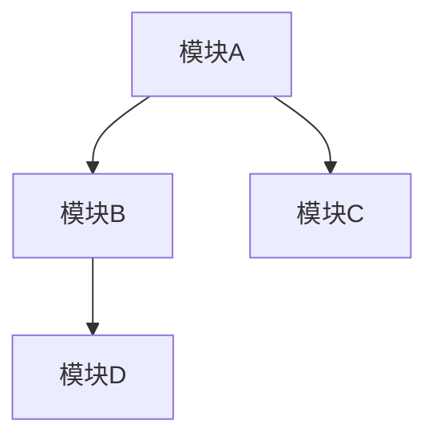

# Skill：SDD 架构设计

## 触发词
- 架构设计
- 技术选型
- 模块划分
- 系统架构

## 适用场景
SDD 文档核心章节编写、技术方案设计、架构评审

## 禁忌场景
详细接口设计、数据库表结构设计、单元测试

## 执行步骤
1. 确定整体架构风格（微服务/单体/分层）
2. 选择核心技术栈与框架
3. 划分功能模块与职责边界
4. 设计模块间交互关系
5. 输出架构图与技术选型说明

## 输出模板
```markdown
## 2. 架构设计

### 2.1 架构风格
{架构风格描述：如微服务架构、分层架构}

### 2.2 技术选型
| 分类 | 技术 | 版本 | 选型理由 |
|------|------|------|----------|
| 语言 | {语言} | {版本} | {理由} |
| 框架 | {框架} | {版本} | {理由} |

### 2.3 模块划分


### 2.4 模块职责说明
| 模块 | 职责描述 |
|------|----------|
| {模块名} | {职责} |

### 2.5 核心设计原则
- {原则1}
- {原则2}
```

## 校验标准
- 技术选型有明确理由支撑
- 模块职责边界清晰
- 包含可视化架构图（Mermaid）
- 设计原则与架构风格一致

## 异常处理
- 技术栈不明确时返回「请明确目标技术栈或提供技术约束条件」
- 模块划分复杂时建议先进行功能拆解