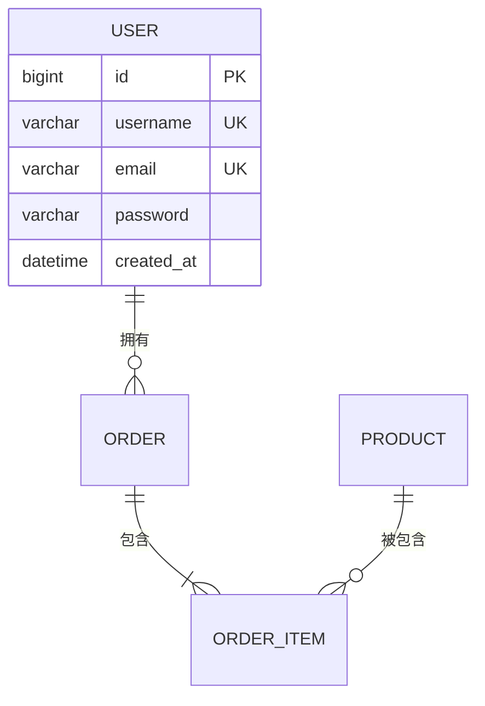

# Skill：SDD 数据模型

## 触发词
- 数据库设计
- 数据结构
- 实体关系
- ER 图

## 适用场景
数据库表结构设计、数据模型定义、数据持久化方案

## 禁忌场景
API 接口设计、业务逻辑实现、前端状态管理

## 执行步骤
1. 识别核心业务实体
2. 定义实体属性与类型
3. 设计实体间关系（1:1、1:N、N:N）
4. 添加索引与约束说明
5. 输出 ER 图与数据表定义

## 输出模板
```markdown
## 4. 数据模型

### 4.1 实体关系图


### 4.2 核心数据表

#### 4.2.1 users（用户表）
| 字段名 | 类型 | 约束 | 说明 |
|--------|------|------|------|
| id | BIGINT | PRIMARY KEY, AUTO_INCREMENT | 用户ID |
| username | VARCHAR(50) | UNIQUE, NOT NULL | 用户名 |
| email | VARCHAR(100) | UNIQUE, NOT NULL | 邮箱 |

### 4.3 索引设计
| 表名 | 索引名 | 字段 | 类型 |
|------|--------|------|------|
| users | uk_username | username | UNIQUE |
```

## 校验标准
- ER 图清晰展示实体关系
- 字段类型、约束完整准确
- 索引设计合理
- 表命名符合规范

## 异常处理
- 业务实体不明确时返回「请列出核心业务实体及属性」
- 关系复杂时建议分模块设计